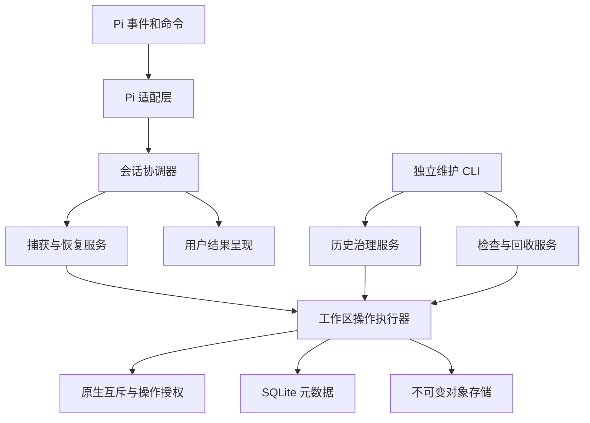

# Cyclotomy 维护与规模治理设计

状态：实施规格与后续路线图。基线：0.2.4（`aa54bab`）。初稿：2026-09-10。修订：2026-09-11。

目标是让历史可以治理、崩溃后能够恢复、运行成本可以测量，并降低维护者理解协议的成本。现有检查点语义、内容寻址存储和恢复前保护机制是这次改造的基础。

## 1. 核心决策

| 领域     | 推荐决策                                   | 必须保住的约束                                       |
| -------- | ------------------------------------------ | ---------------------------------------------------- |
| 历史治理 | 先支持整会话清理，随后按需加入节点过期     | 清理必须由明确操作或已启用的保留策略授权             |
| 互斥     | 使用进程/句柄生命周期管理的原生整文件锁    | 所有写入者使用同一协议；锁文件保持稳定               |
| 存储回收 | 分开历史引用删除、对象回收、压实与完整检查 | 任何物理删除都必须有完整的存活依赖证明               |
| 性能     | 先建立数据集和预算，再优化重复工作         | 缓存不能把不完整观察变成完整检查点                   |
| 协议     | 明确状态所有者，统一完成操作的出口         | 业务结果、工作区副作用、保护状态和清理结果仍独立表达 |
| 宿主兼容 | Pi 语义集中在适配层，维护实测版本契约      | 无法确认当前位置时停止相关写入，保留独立维护能力     |

近期保留 v3 树格式、pack 格式及已有解码器。历史格式已经发布，迁移责任是真实存在的。

兼容升级由正常可写打开自动触发，不提供 `cyclotomy upgrade`。元数据、树格式与锁协议分别维护自己的有序版本表及相邻迁移；Pi 和 CLI 复用这些模块的入口。新存储直接初始化到当前状态，已是当前状态则跳过迁移，未知或更高版本明确拒绝。只读诊断和删除预览不迁移；旧目录锁确实无法释放时仍需独立的离线恢复。

具体取得规则、CLI 产品契约与性能门槛分别见 [锁协议过渡规格](lock-transition.md)、[维护 CLI 契约](maintenance-cli.md)、[性能假设与验收预算](performance-contract.md)。这些文档分别描述当前行为、验收要求与明确标注的后续候选。

## 2. 目标结构与职责



图中的服务表示职责边界，不要求每个方框都新增一个类。优先调整现有模块的所有权。

| 所有者           | 管理的状态                                        | 不应承担的职责                        |
| ---------------- | ------------------------------------------------- | ------------------------------------- |
| Pi 适配层        | 原始事件、条目投影、宿主活动状态                  | GC 策略、SQL、物理文件改写            |
| 会话协调器       | 当前观察、待完成导航、进程内操作代次              | pack 选择、路径分类、权限位细节       |
| 元数据层         | checkpoint slot、历史生命周期、持久保护与版本栅栏 | 用户对话、根据 JSONL 缺失推断会话死亡 |
| 工作区操作执行器 | 互斥获取、授权传递、完成与清理                    | 推断用户是否愿意删除历史              |
| 对象存储         | 发布、读取、表示依赖、物理回收                    | Pi 条目语义与交互提示                 |
| Presenter        | 业务结论、影响、下一步                            | 通过错误字符串判断文件是否已经改动    |

`runtime.ts` 作为组装入口；业务服务复用现有实现。只有存在两个真实调用方时才抽取共同接口，不建立可插拔存储后端框架。

## 3. 历史清理：把保留决定与物理回收分开

`forget` 修改元数据引用；`gc` 回收失去引用的物理数据。这一分工使删除历史不必先读取所有 blob，也能清楚解释为什么删除若干检查点不等于立即释放同等字节数。restic 也将这两步区分，并提供删除预览。[参考](https://restic.readthedocs.io/en/stable/060_forget.html)

当前只处理整会话历史。它可以释放旧会话的对象和大量 slot 行，同时避免在会话树内部制造含糊的继承空洞。

独立维护 CLI 提供 `doctor`、`history` 和 `inventory`，包括单会话 slot 数、不同根数、空间观测/估算与容量提示。不需要等历史删除或 expired 才能让用户看见长期会话的增长。

历史治理提供 `history forget <session-id>` 预览，以及携带 plan token 的应用操作。工作区解析、语言、bin 产物、退出码和 JSON 一致性规则以 [CLI 契约](maintenance-cli.md) 为准。

维护能力不依赖 Pi 是否正常加载。后续若增加 Pi 内历史界面，应调用同一业务服务；`pause/resume` 与 `enable/disable` 保留现有含义。

### 3.1 清理事务

1. 明确目标工作区和会话，生成包含当前历史指纹的预览。
2. 应用时取得工作区互斥，重新读取目标历史；预览之后发生变化则要求刷新范围。
3. 在一次元数据事务中把 `history_epoch` 从 e 推进到 e+1，移除旧 slot 和旧 capture barrier，留下不含树引用的 reset-pending 标记。
4. 提交后释放互斥。GC 成功与否不改变已经完成的引用删除。

清理标记不含 `tree_oid`，不成为 GC 根；它记录被主动清理的历史，不保存一份暗中的可恢复快照。

所有业务写入在互斥内核验 `history_epoch`。同版本实例持有的旧 epoch 一旦失效，旧代操作不能提交；不得通过自动重新注册或父会话导入复活旧历史。

重新使用同 sessionId 的规则固定为自动接入 forget 已经分配的 e+1，不再额外确认，也不在每次打开时继续 epoch+1：

1. 在新的稳定 Pi 观察边界，持互斥读取当前 epoch 和 reset-pending。
2. 第一个接入者对当前已存在坐标建立未覆盖/保护状态，并以 epoch 条件提交 reset-pending 的完成；其他接入者复用这次完成结果，不重新推进代次。
3. 这一步不捕获工作区内容，不恢复旧树引用。沿用重新载入保护流程；需要的保护行可以重新建立，但它们不持有历史 blob。
4. UI 明示“既有检查点已清理，新检查点从之后的新工作开始”。后续新工作可产生检查点，旧坐标不会被自动补写。显式重建当前检查点仍属于独立的用户操作。
5. 已取消的恢复或旧代提交不自动重放。宿主图尚不稳定时等待下一个合法边界，不伪造初始化成功。

这个流程必须覆盖重复重开、两实例同时接入、forget 与捕获竞争，以及第一次接入中途退出。epoch 每次成功 forget 只递增一次。

不同失效机制要分开报告：

| 情况                            | 原因                       | 处理与提示                                                           |
| ------------------------------- | -------------------------- | -------------------------------------------------------------------- |
| 0.2.4 遇到已激活的原生锁文件    | 旧客户端不能取得该锁协议   | 新 doctor 解释 unsupported-lock-protocol；不能承诺修改旧二进制的提示 |
| 冷开 V5 的 V4 读取器            | 元数据版本高于可读版本     | store-too-new，选择支持该格式的软件                                  |
| 已打开的 V4 连接遇到 V5 升级    | 事务入口发现 schema 已变化 | store-upgraded，关闭旧连接和授权                                     |
| 同版本实例的 history_epoch 变化 | 用户清理了该会话历史       | history-reset，撤销旧代操作并在合法边界接入新代                      |
| 原生锁或目录身份失配            | 本次物理授权失效           | authority-lost，永久吊销该操作授权                                   |

writer fence 是额外的 SQL 写入约束，不把冷开版本拒绝、连接版本变化和 history_epoch 校验统称为“旧运行时失效”。

### 3.2 删除边界

- 只清理 Cyclotomy 历史，不删除 Pi JSONL 或工作区文件。
- 子会话已经持有的根继续有效；删除父会话不能连带删除子会话历史。
- 相同内容仍被其他会话引用时继续保留。
- 预览中的引用数量可以精确计算；物理释放量由 GC 实测，估算必须标明。
- 已清理内容不承诺可撤销。临时对象宽限期不构成恢复服务。
- 元数据行删除后，SQLite 可复用页面；文件缩小可能需要另行整理，不把 `VACUUM` 绑定在日常清理事务中。

当前不自动过期现有历史。之后可以增加用户明确启用的整会话保留规则。规则描述的是保留意愿，不能把超时、心跳或 JSONL 缺失解释成会话已死亡。容量提示不授权任何删除。

整会话清理仍不能约束一个持续活跃的大会话，必须在产品说明和容量报告中明确这一点。

### 3.3 单会话内部过期需要新的语义

假设会话路径是 `A → B → C`，A、B 有检查点，C 使用祖先检查点。直接删除 B 的 slot 会让 C 回退到 A，悄悄改变历史含义。

因此，节点级保留策略必须先实现终止继承查找的 `expired` 状态：

```text
A: snapshot A
B: expired
C: no own checkpoint

resolve(C) = unavailable because history expired
```

`expired` 不含树引用，但不能被当作普通 missing。它也不能直接复用当前允许继续向祖先查找的 blocked-missing。

第一种节点策略建议只做按实际捕获顺序保留最近 N 个检查点。过期后允许显式重建当前检查点，界面必须区分“从未记录”和“已按策略清理”。更复杂的按日、按周抽样等策略应等实际需求出现。

## 4. 互斥：让崩溃释放成为系统属性

推荐用稳定锁文件上的整文件锁：Unix-like 使用 `flock`，Windows 使用 `LockFileEx`。操作结束关闭/解锁句柄；进程退出由系统释放锁。Windows 的释放可能有短暂延迟，等待仍需要截止时间与取消。[Windows 语义](https://learn.microsoft.com/en-us/windows/win32/api/fileapi/nf-fileapi-lockfileex)

保留现有 `WorkspaceWriteAuthority` 的永久吊销和目录绑定语义。原生互斥不能单独充当工作区写权限。

锁协议复用同一个 `workspace.lock` 路径：旧协议使用目录，新协议使用常驻零长度普通文件，并记录已完成的 lock-protocol 标记。0.2.4 会拒绝普通文件形式的该路径，因此旧写入者由锁路径类型排斥。

旧目录到新文件不能原子替换。交接必须真实取得旧目录锁，验证后释放，再独占创建文件；若旧进程抢先建立目录，新实现退回等待，期间没有业务写权限。只看“owner 不活动”后锁另一个文件不是有效的取得规则。

正常原生取得、标记缺失或不一致、切换中途退出、身份替换和多版本竞争均按 [锁协议过渡规格](lock-transition.md) 执行。它包括精确 BigInt 的根、父目录链、句柄与路径复核，以及失配后不能因路径恢复而复活授权的规则。

同进程按工作区排队，多工作区沿用确定物理顺序。锁文件不随操作释放而删除，PID/开始时间仅用于诊断，不按心跳过期抢锁。原生依赖可以接受，但所有写入者必须使用可相互排斥的协议。

### 4.1 实现选择的验收门槛

选择依赖前检查其发布包与原生实现，而不只看 README：

1. 三平台及实际承诺的架构有可用产物，Node 24.15 能加载。
2. 在现有 `npm ci --ignore-scripts` 和 tarball 安装检查下可用，不暗中要求用户安装编译器。
3. 同进程不同句柄、多个进程、路径别名均确实互斥。
4. 持有者被杀死后，后继操作无需修改锁文件即可取得锁。
5. 关闭同进程中另一个普通读取句柄不能解除该操作的锁。
6. 不存在句柄泄漏、意外继承或不可取消的线程池阻塞等待。

本轮采用 `fs-native-extensions@1.5.1`。macOS 的当前与最低 Node/Pi 组合已通过安装、互斥和旧版交接检查；Linux、Windows 及承诺架构的验收继续由对应平台 CI 完成。[依赖项目](https://github.com/holepunchto/fs-native-extensions)

### 4.2 崩溃后的数据状态

自动释放锁不等于回滚工作区文件。恢复中途退出仍可能留下部分改写。现有“先持久保护、再改工作区”的顺序必须保留；重新进入时检查点仍可用，但当前文件要按未验证状态处理。

锁故障、元数据故障和对象损坏必须分别报告。`doctor` 不以删除锁数据库、WAL 或 journal 的方式修复未知故障。

## 5. GC：先拆职责，再改变复杂度

四个动作分别有明确职责：

| 动作    | 决定什么                     | 不应决定什么           |
| ------- | ---------------------------- | ---------------------- |
| forget  | 哪些历史不再保留             | 哪个 pack 可以物理删除 |
| gc      | 哪些对象已经不可达           | 用户愿意放弃哪段历史   |
| compact | 如何在给定预算内重写存活数据 | 当前 Pi 坐标是否可捕获 |
| check   | 数据是否完整、可认证         | 是否应过期历史         |

成熟工具会区分引用清理、压实预算与完整读取检查。这里借鉴职责划分，不直接降低现有删除前验证强度。[回收与压实预算](https://restic.readthedocs.io/en/stable/060_forget.html)、[完整数据检查](https://restic.readthedocs.io/en/stable/045_working_with_repos.html#checking-integrity-and-consistency)

### 5.1 可控回收

- 历史清理使用元数据维护入口，不先打开整个 CAS 或运行 GC。
- 原有完整验证保留；把大规模回收明确放进可观察、可取消的维护操作。
- 自动维护只执行已测量适合交互场景的工作量；过大时提示需要维护窗口，不反复阻塞每次输入。
- 压实按重写字节、暂存空间和操作时间控制；先发布并验证替代包，再删除旧包。
- 空间紧张时优先删除已经证明完全无引用的包，允许本次不压实混合包。无法证明安全时报告需要额外空间。

### 5.2 当前规模边界与后续方案

当前 GC 在内存中保存根、对象库存和存活集，内存需求仍随历史规模增长；超过单次可认证范围时拒绝删除。时间与压实预算限制本次维护工作量，不构成与仓库规模无关的内存上界。

后续可通过流式根枚举、分片库存扫描与磁盘暂存的 mark 集降低全局工作集的内存需求。这是性能契约中的 H4 候选，尚未实现。单树和单对象的格式上限仍需保留。

完整 GC 在维护窗口中持续持有工作区写互斥。这会占用较长时间，但比引入未经证明的在线增量 sweep 更容易保持正确性。取消发生在明确边界；每个已经完成的删除批次都必须独立安全。

若后续要在 GC 中途释放写锁，必须另立并发设计：根修订记录、新增引用的写屏障、同一时刻唯一维护者，以及删除前追平新增根。仅凭“对象比 GC 开始时间老”不能删除，因为旧对象可能重新变成可达。当前 GC 不在中途释放写锁。

### 5.3 缓存与物理表示

逻辑内容 ID 与物理表示是不同层次。同一内容可能同时有完整表示、分块表示或 delta；它们的依赖不同。

缓存不能只保存 `contentId → children` 然后作为删除依据。它必须绑定确切表示及其物理位置，并覆盖 recipe、chunk、delta base 和保留包中的实际提供者。损坏或无法验证的缓存必须重建或停止本次删除。

任何降低全量认证成本的后续优化，都以“保留的检查点仍至少具有完整、健康的实际表示闭包”为验收条件，继续包含已经发现过的完整/分块表示共存回归场景。

## 6. 捕获性能：用可证伪假设和数字验收

捕获保留两次完整内容观察。stat 收据并非可证明唯一的内容版本号；“已识别的变更文件已认证”不能证明识别了全部变更。最终校验还必须覆盖外部 Git 策略、排除项和目录身份。

[性能契约](performance-contract.md) 逐项对照 `workspaceSnapshotsEqual`，将 stat-only 替代方案 H1 列为当前契约下不接受的候选；保留 H2 操作内结构认证复用、H3 扫描与发布协作和 H4 磁盘 mark 工作集三个可证伪方向。

契约固定 R1 参考环境、P1/P2/G1/G10/Q 数据集、采样方法和数字门槛，例如：H2 至少降低重复读取中位耗时 20%；H3 至少减少工作区读取字节 25%，且总 I/O 不增加超过 5%；GC 的历史根扩大十倍时，GC 峰值 RSS 增量不超过 128 MiB、耗时比不超过 15。其他捕获场景的 p95 与峰值 RSS 回归不得超过 10%。

这些是拟定验收值，不是现有测量成绩。性能验收需要固定环境清单、基线与原始结果。预算变更单独评审，不能在看到失败后修改阈值。共享 CI 的时间趋势不代替固定环境门槛。

数值限额不等于交互延迟承诺，两次观察一致也不等于原子文件系统快照。未来如有更强的快照/变更来源，需要另行证明替代性，而非用缓存改变现有语义。

## 7. 协议与呈现：减少理解路径，而非抹去副作用

保留业务结果、工作区副作用、持久保护和资源清理的区分。重点是让上层只消费一次已经完成归纳的操作结果，而不用自己拼装多个 receipt 和补救调用。

建议将完成流程集中到工作区操作执行器与会话协调器的固定出口：

```text
运行操作 → 确定工作区影响 → 完成必要保护 → 释放资源 → 呈现用户结果
```

每个出口明确回答四个问题：操作是否完成；文件是否可能已改动；当前坐标是否受到保护；清理是否成功。内部低层结果可以保留更细信息，但不把全套协议细节交给每个调用方。

`cutover.rejected` 的工作区边界语义仍成立。上层诊断另外说明是否已经写入保护元数据，不承诺失败意味着数据库和文件系统一起回滚。

Presenter 使用稳定的业务结论，再组合文件影响、保护状态和清理问题。避免为所有组合分别复制完整中英文文案；也不通过错误文本决定恢复行为。

术语表优先定义 checkpoint、slot、session coordinate、history epoch、operation authority、protection、logical object、physical representation。宿主运行代次、历史清理代次和存储 schema version 分别说明，不用一个含糊的“generation”覆盖它们。

## 8. 宿主兼容与独立维护

Pi 原始事件与条目枚举集中在适配层。核心服务接收 Cyclotomy 的会话观察与操作意图。真实宿主的事件含义变化，原则上不应要求改动存储层。

- npm peer 声明为 Pi/TUI `>=0.84.0`；minimum/current 宿主契约测试验证最低版本与锁定版本，latest 探测跟踪新发布的 Pi。
- npm peer 范围是兼容声明，不是可信的运行时宿主版本证明；不能把扩展自己解析到的 SDK 包版本当作正在运行的 Pi 版本。
- 最低版本与锁定版本的契约失败阻止发布；latest 探测提供兼容信号，定时运行失败会暴露上游变化。
- 契约测试关注回调时机、活动状态、取消后是否到达、何时公开持久化以及运行时替换。Fake Pi 复用这些可验证的行为样例，不能成为宿主语义的唯一来源。
- 无法确认 Pi 坐标时关闭相关自动捕获与恢复。独立的历史查看、存储诊断和维护 CLI 仍可使用；当前节点漂移检查也必须以坐标可确认作为前提。

README 补齐元数据恢复边界、跨 clone 去重范围、平台能力差异，以及进程崩溃和断电保证的区别。CI 通过不代表 owner、ACL、xattr、目录持久化语义在所有平台等价。

peer 范围收紧必须在 release notes 中列为安装契约变化，说明 npm 冲突解析与告警行为、Pi 管理安装路径和兼容版本选择。canary 是发现机制，不是对未来宿主的预防保证；发布模板和安装测试按 [CLI 契约](maintenance-cli.md) 落实。

## 9. 自动升级与验收

元数据使用按连续版本号排列的只读数组，直接定位当前版本并执行剩余步骤；树格式和锁协议使用有序数组及一次建立的标识索引。最新版来自表尾。各版本表独立推进：SQL 迁移逐步事务提交；树格式先准备对象再切换引用；锁协议通过交接函数取得目标互斥。每次转换验证结构、复核源版本并隔离旧写入者。

正常可写打开覆盖全新工作区、已发布旧库、交接中断和取消。forget 的历史格式预览与应用遵守 [CLI 契约](maintenance-cli.md)；内部迁移保持已确认的删除范围。

目录锁到原生文件锁的交接依赖 0.2.4 已有的路径类型检查。元数据 V4→V5 的版本拒绝与 history_epoch 分别保护格式兼容和历史生命周期。锁与元数据独立提交，交接中断可能留下原生锁与 V4 元数据，后续可写打开继续迁移；这不是另一条已发布客户端版本线。

旧新协议检查使用实际发布的 0.2.4 包，覆盖持有顺序、竞争与中断。真实 Pi 捕获、恢复和维护 CLI 的 GC 另行验证外部进程持锁期间的业务写入边界。测试范围详见 [锁协议规格](lock-transition.md#7-验收覆盖)。

升级前需要一致备份。若原生锁交接后元数据仍为 V4，可以在所有访问者退出并核验存储后受控回退锁协议。元数据已升级 V5 时，安装 0.2.4 不会降级存储，必须恢复升级前同一时点的元数据及对象。不能通过降低 user_version 或只复制主数据库实现回退。

| 领域           | 当前范围                                          | 验收标准                                                                     |
| -------------- | ------------------------------------------------- | ---------------------------------------------------------------------------- |
| 诊断与可见性   | 只读 doctor/history/inventory、容量提示、CLI 产物 | 不迁移、不把未检查当健康；并发时结构化降级；区分物理字节、可复用页和逻辑估算 |
| 锁协议         | 原生锁、自动交接、离线目录恢复、物理身份永久吊销  | 三平台协议矩阵、真实业务入口与故障注入均通过                                 |
| 整会话历史治理 | V5、forget、history_epoch、幂等重开               | 旧代不能提交；多实例不复活历史；重开不反复增 epoch、不补写旧坐标             |
| 物理回收       | 内存 mark 与库存、时间和压实预算、维护窗口        | 保留根可读取；低空间、取消与清理失败结果正确；性能数字另按参考环境验收       |
| GC 规模优化    | 后续候选：H4 流式枚举与磁盘 mark                  | 删除范围等价，资源上界及固定参考环境的性能预算均通过                         |
| 长期活跃会话   | 后续提案：expired 与节点保留策略                  | 引入前证明中间检查点过期不改变祖先继承语义                                   |
| 捕获优化       | 后续候选：H2/H3                                   | 等价性、资源上界和实际性能收益同时成立                                       |

GC 性能测量通过 `npm run test:performance:gc` 独立运行，脚本为 `scripts/gc-performance.ts`。默认规模用于观察趋势；固定 R1 环境和完整数据集才用于数字预算验收。普通功能测试验证数据安全、取消和资源清理。

发布验证包含安装、真实 Pi 集成和三平台原生锁检查。性能验收需附固定环境的原始结果，功能测试通过不代替数字预算通过。
